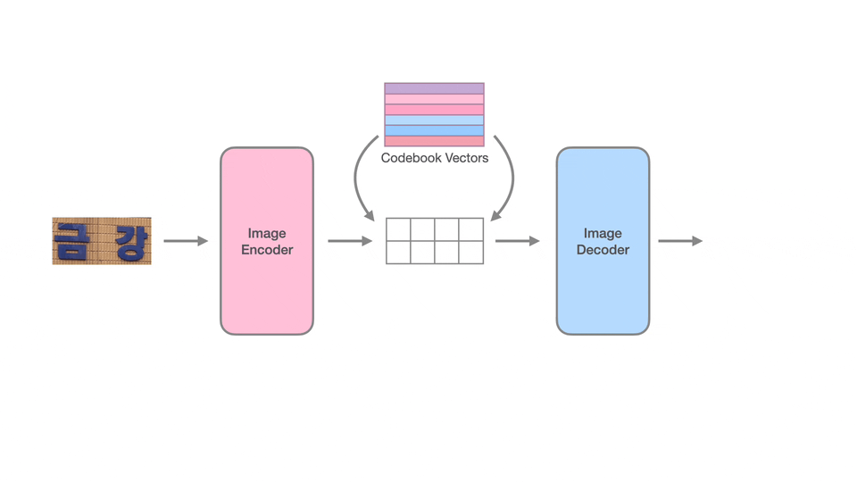
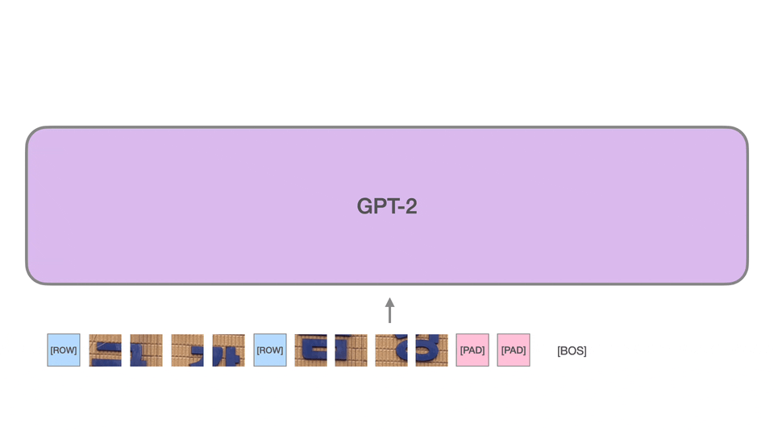
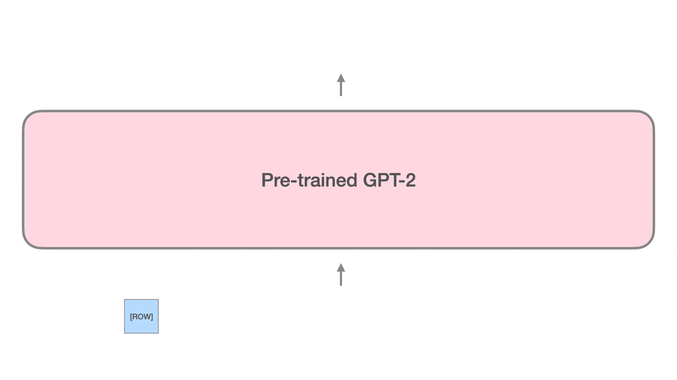
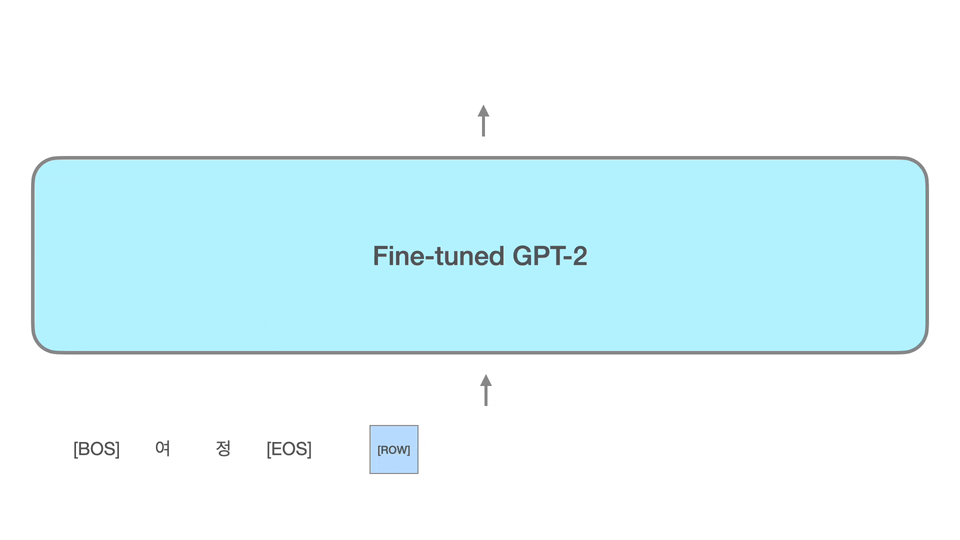

# Inverse DALL-E for Optical Character Recognition

## Introduction
This is a research project to apply DALLE-E for Korean optical character recognition task.

[DALL-E](https://github.com/openai/DALL-E) successfully shows that the image can be treated as a sentence through vector-quantization models (e.g. dVAE, VQVAE, VQGAN, etc.) and GPT-3 can learn a relationship between images and texts. And the transformer model can understand characters in the image, which was experimented from [CLIP](https://github.com/openai/CLIP) with rendered SST2 dataset. Moreover, [CogView](https://github.com/THUDM/CogView) can generate a description from the image by finetuning the pretrained image-generation model with image captioning dataset.

While DALL-E and CogView focus on contextual text-to-image or image-to-text translation, we tried to adapt the concept of DALL-E to the optical character recognition. CLIP can understand the language from rendered characters in the image and DALL-E can draw a pot with 'GPT' letters. According to the results of these models, we thought it would be possible to recognize characters from the image precisely. And finally we introduce **Inverse DALL-E**, which is trained for Korean optical character recognition (OCR).

## How it works

### Vector-quantization for encoding image as a sequence

<p align="center">
  
</p>

VQVAE makes images like a sentence by using vector-quantization. VQVAE is trained for encoding an image to a sequence of visual tokens and reconstructing the original image from the tokens. While training, VQVAE will learn the context-rich vocabulary of image constituents. Each image patch will be encoded to its representation vector and mapped to the closest codebook vector. Because the number of visual tokens (size of the vocabulary) is limited, the quality of reconstructed image should be worse than the original one. One of the possible solutions is to increase the vocabulary size to make the model represent more contextual informations on the visual tokens. Surprisingly, it is shown that to enrich representations is helpful for both reconstruction quality and translation perplexity (i.e. autoregression of quantized image sequences on GPT-like transformer models).

### Image-to-text captioning using GPT-2

As mentioned above, VQVAE is for encoding continuous image data to quantized text-like sequence. Similar to the NLP tasks which use sequences of subwords, the image sequences can be applied to the traditional NLP models such as LSTM, Transformer, GPT, BERT, etc. [BEiT](https://arxiv.org/abs/2106.08254) is one of the successful researches to apply images on transformer-like model with vector-quantization encoding. Many researches show that there is no big difference between image sequences and the original text sequences (e.g. english, korean, etc.), and it leads the multimodal problems such as image-to-text and text-to-image to be one of translation problems. Using the visual tokens, text-conditioned image generation and image-captioning are equivalent to the translation task.

<p align="center">
  
</p>

DALL-E uses GPT-3 for translating from natural language to the image language to generate images conditionally. Contrary to the original approach, we change the order of input prompts to make the image tokens first. The transformer model will learn language-modeling for image-wise, text-wise and conditioned image-to-text generation. We found that it is sufficient to use small GPT-2 models instead of large-scale language models like GPT-3. Because the goal of this model is not for generating the contextual description of images, the vocabulary does not need to contain subwords. With the character-only vocabulary, you can use smaller transformer model with faster speed, lower latency and higher accuracy.

### Dynamic shape encoding

The most challenging of the OCR tasks should be dynamic image shape (aspect ratio). Usually texts are written in left-to-right direction, so many OCR models use fixed horizontal shape. But it is hard to process various image sizes with a single model. We considered to pad the images to be a square shape, but we soon found that the wasted padding tokens are too many and the absolute image resolutions should be smaller to reduce the length of image sequences. For example, if an image with shape 256x64 is encoded with VQVAE-f16 then the number of necessary image tokens is 64 (256 * 64 / 16 / 16). However, if the image is padded and then encoded, the length of image sequence with padding is 256 (256 * 256 / 16 / 16). As you can see, **75% of tokens are wasted** and if we want to limit the length to 64, then the image should be downscaled!

<p align="center">
  
</p>

Therefore we designed new sequence encoding method. First of all, *start-of-row* tokens will be added to the first of encoded (vector-quantized) rows of tokens. And then the tokens will be flatten to be 1D sequence. To maximize the efficiency of the image resolution, we will reversely calculate the proper image resolution. After encoding images, the padding tokens will be added to the end of the sequences to match the length. That's all. The transformer model should learn image structure from the *start-of-row* tokens and can recognize the orientation of each image.

The belows are examples of horizontal image predictions:
| <image src="images/horizontal-1.png" width="128"> | <image src="images/horizontal-2.png" width="128"> | <image src="images/horizontal-3.png" width="128"> | <image src="images/horizontal-4.png" width="128"> | <image src="images/horizontal-5.png" width="128"> |
|:-:|:-:|:-:|:-:|:-:|
| 하정 | 백화점 | 상산치과 | 금강 | 조 헤어샵 |

The belows are examples of vertical image predictions:
| <image src="images/vertical-1.png" height="128"> | <image src="images/vertical-2.png" height="128"> | <image src="images/vertical-3.png" height="128"> | <image src="images/vertical-4.png" height="128"> | <image src="images/vertical-5.png" height="128"> |
|:-:|:-:|:-:|:-:|:-:|
| 판매수리 | 고래진식당 | 옷수선 | 않네 | 여정 |

Using the dynamic shape design, our model successfully recognize characters from many different shape of images.

### Unconditional image generation using pretrained model

<p align="center">
  
</p>

While our model is trained for not only generating the characters written in the images but also image-wise and text-wise autoregression, the pretrained model can generate images without any conditions. Interestingly, if we do not stop generation at the end of the image sequence, then the model will also generate the characters. Namely, the model creates new image and recognize the image by itself. Here are some examples of unconditional image generation and self-captioning:

| <image src="images/unconditional-1.png" width="150"> | <image src="images/unconditional-2.png" width="150"> | <image src="images/unconditional-3.png" height="100"> | <image src="images/unconditional-4.png" height="100"> | <image src="images/unconditional-5.png" width="150"> |
|:-:|:-:|:-:|:-:|:-:|
| 서일데이 | 만우기용실 | 욕실 | 마트 | 공작술 |


### Finetuning text-to-image generation

Although our model is trained for detecting characters from images, it can be finetuned to generate from texts. The main approach is same as DALL-E. The difference is that our model is already pretrained for OCR tasks and understand relations between image and text. Therefore we can expect the model reversely generate new image which contain the given characters. Of course other things like position embeddings and masked self-attention are optimized for generating texts from images, so we should finetune to let the model create images instead of texts.

<p align="center">
  
</p>

The belows are some example images generated from the prompt texts. The characters are written in the images. The font style and colors are randomly selected and rendered by the finetuned GPT-2 model. Note that all images are generated by tokens from GPT-2 model first and then decoded by VQVAE decoder to convert the visual tokens to the continuous image format.

| 선택약정 | 행복 | 중심대학 경진대회 | 아보카도 팀 | 문자 인식 모델 |
|:-:|:-:|:-:|:-:|:-:|
| <image src="images/text-to-image-1.png" width="128"> | <image src="images/text-to-image-2.png" width="128"> | <image src="images/text-to-image-3.png" width="256"> | <image src="images/text-to-image-4.png" width="256"> | <image src="images/text-to-image-5.png" width="256"> |

## Requirements

This project requires below libraries:

* omegaconf
* opencv-python
* pandas
* pytorch_lightning
* scikit_learn
* torch
* torchvision
* wandb
* tqdm

You can simply install the requirements using pip.
```bash
$ pip install -r requirements.txt
```

In addition, we strongly recommend to use [NVIDIA Apex](https://github.com/NVIDIA/apex). It helps automatic mixed precision (AMP) and fused operations to accelerate training and inference. Run the below codes in the terminal and enable the performance boosting:

```bash
$ git clone https://github.com/NVIDIA/apex
$ sed -i "s/or (bare_metal_minor != torch_binary_minor)//g" apex/setup.py
$ pip install -v --disable-pip-version-check --no-cache-dir --global-option="--cpp_ext" --global-option="--cuda_ext" apex/
$ rm -rf apex
```

### Using docker with prebuilt image
You can use docker and prebuilt nvidia image which is optimized for NVIDIA GPUs. Some CUDA kernels and libraries are already optimized and NVIDA Apex is installed as well. It is useful when you are trying to run this project on cloud environment. Make sure docker is available. Use the below command to run the optimized pytorch prebuild container. This project is tested on `pytorch:22.08-py3` image.
```bash
$ docker run --gpus all -it --rm nvcr.io/nvidia/pytorch:22.08-py3
```

## Usage
This project consists of two sub-projects and utility scripts for generating datasets.

### Prepare training datasets
The dataset preprocessing script is [scripts/process_external_dataset.py](scripts/process_external_dataset.py). This script is for extracting Korean OCR images and their characters from the original dataset. You can download the Korean OCR dataset on [AIHub](https://www.aihub.or.kr/). After downloading all datasets, you can simply generate the full dataset by using [this bash script](scripts/preprocess-aihub-ocr.sh).

### Train VQVAE model
The detailed training configuration of VQVAE is in [this file](vqvae/config/vqvae-f16-16384.yaml). You can create new configuration file or just modify some hyperparameters in the configuration. With the prepared configuration file, you can train VQVAE with the below command:

```bash
$ python src/train.py config/vqvae-f16-16384.yaml
```

Note that you have to move to the [vqvae](vqvae) directory first.

### Generate visual tokens from images
The images should be encoded to the visual tokens to train a transformer model. Check if the checkpoint file is created properly. It should be `last.ckpt`. Using this file, generate the visual tokens from images:

```bash
$ python src/predict.py config/vqvae-f16-16384.yaml last.ckpt --dataset resources/external.csv --output external-f16-16384.csv --batch-size 64 --max-length 128
```

The maximum length of visual tokens is set to 128 in our experiments. It can be modified by `--max-length` option.

### Train Inverse DALL-E
With quantized images and their characters, Inverse DALL-E can be trained by using:
```bash
$ python src/train.py config/gpt2-base.yaml
```

The dataset paths for training and validation are `data.train_dataset` and `data.val_dataset` respectively. Change to your own datasets. Like training VQVAE, the checkpoint file will be created. Remember the checkpoint file path and export to the huggingface transformer format:

```bash
$ python src/export.py config/gpt2-base.yaml last.ckpt
```

Then `gpt2-base` directory will be created with trained GPT-2 weights and vocabulary file.

### Finetune for text-to-image generation
As mentioned above, the model can generate reversely.
```bash
$ python src/finetune.py config/gpt2-base-finetune.yaml
```
After training, you can find `gpt2-base-finetune` directory which is for text-to-image generation.

## License
This project is not licensed yet. It will be updated after it is decided. Separately, this document is licensed under the **Apache License 2.0**.
